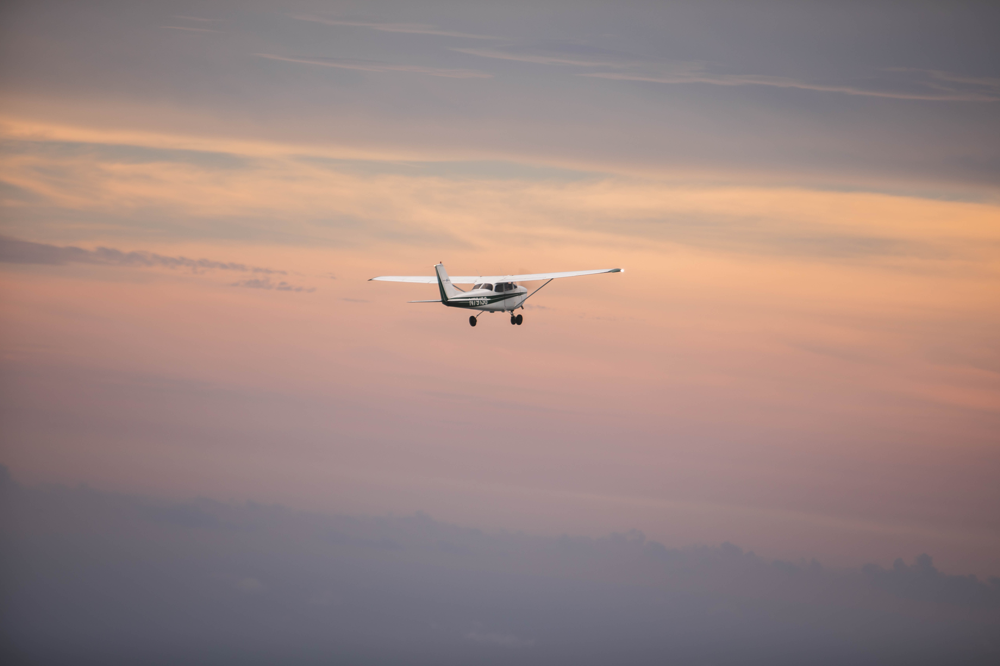
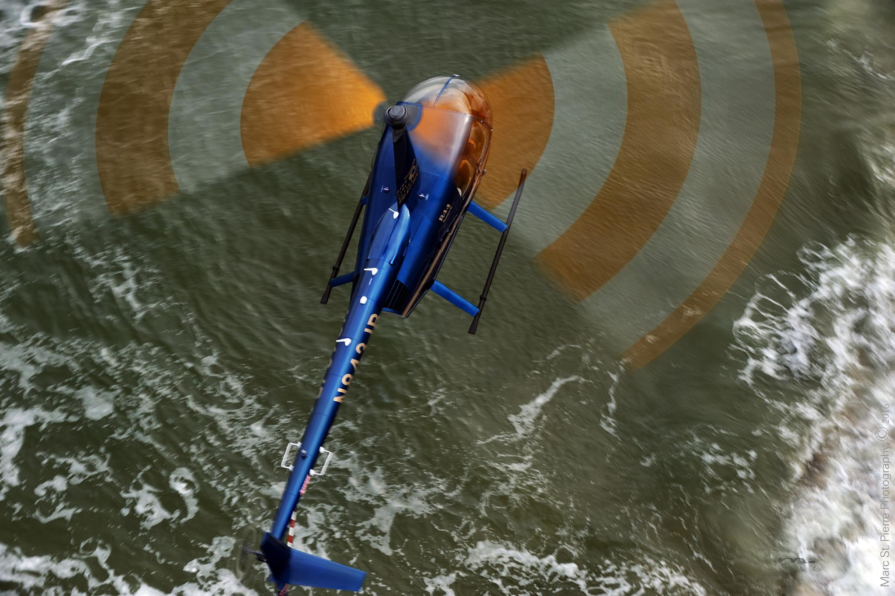

At High Tide Aviation, we are dedicated to providing a wide range of services that meet the diverse needs of our clients. Our commitment to excellence and innovation has led us to expand our offerings, utilizing our modern fleet of aircraft for various purposes. From aircraft maintenance and brokerage to stunning aerial photography for real estate showcasing, our extended services are designed to provide comprehensive solutions for our clients. Here, we highlight the additional uses of High Tide Aviation's fleet and services, showcasing how we can help you achieve your goals.

**Aircraft Services: Ensuring Safety and Reliability**

One of the core services we offer at High Tide Aviation is comprehensive aircraft maintenance and repair. Our team of experienced technicians is dedicated to ensuring that every aircraft in our care is maintained to the highest standards of safety and reliability. Our state-of-the-art facilities are equipped to handle a wide range of services, including routine maintenance, complex repairs, and detailed inspections. Whether you own a single aircraft or manage a fleet, you can trust us to keep your aircraft in top condition.

In addition to maintenance and repair, we also offer aircraft brokerage services. If you are looking to buy or sell an aircraft, our team of experts is here to assist you. We provide comprehensive support throughout the entire process, from market analysis and valuation to negotiations and closing. Our extensive network and industry knowledge enable us to connect buyers and sellers, ensuring a smooth and successful transaction. Whether you are a first-time buyer or an experienced aircraft owner, our brokerage services are designed to meet your needs and help you achieve your goals.

**Aerial Photography and Videography: Capturing Unique Perspectives**

High Tide Aviation's aerial photography and videography services are another area where our fleet's potential is fully realized. Utilizing the latest technology and equipment, our skilled pilots and photographers capture breathtaking aerial images and videos that provide a unique perspective. Our services cater to a wide range of needs, including real estate showcasing, construction documentation, marketing, and special events.

For real estate professionals, our aerial photography services are an invaluable tool for showcasing properties. High-quality aerial images and videos can highlight a property's features, provide a comprehensive view of the surrounding area, and create a compelling visual narrative that attracts potential buyers. Whether you are marketing a residential home, a commercial building, or a large development, our aerial photography services can enhance your marketing materials and help you stand out in a competitive market.

In the construction industry, our aerial photography and videography services provide a powerful way to document progress and monitor large projects. Regular aerial surveys can capture detailed images of a construction site, allowing project managers to track progress, identify potential issues, and make informed decisions. Our services are designed to provide accurate and timely information that supports successful project management.

**Enhanced Focus on Real Estate Showcasing**

One of the standout features of our aerial photography services is our enhanced focus on real estate showcasing. High Tide Aviation understands the importance of presenting properties in the best possible light. Our aerial photography and videography services are tailored to capture the essence of a property, highlighting its unique features and creating a visually compelling presentation. From luxury homes and sprawling estates to commercial properties and development sites, our team works closely with real estate professionals to deliver stunning imagery that elevates their marketing efforts.

**Aircraft Brokerage: Navigating the Market with Expertise**

Navigating the aircraft market can be a complex and challenging process, but with High Tide Aviation's brokerage services, you can count on expert guidance and support. Our team has extensive experience in the aviation industry, and we leverage this knowledge to assist clients in buying and selling aircraft. We provide comprehensive market analysis, accurate valuations, and strategic advice to ensure that our clients make informed decisions. Whether you are looking to purchase your first aircraft or sell an existing one, our brokerage services are designed to facilitate a smooth and successful transaction.

**Additional Services:**

At High Tide Aviation, we are constantly exploring new ways to utilize our fleet and expand our services. In addition to aircraft maintenance, brokerage, and aerial photography, we offer a range of other services designed to meet the diverse needs of our clients. Our flight training programs, for instance, provide aspiring pilots with the skills and knowledge they need to achieve their aviation goals. Our private pilot training program offers a comprehensive curriculum, hands-on experience, and personalized instruction from experienced flight instructors. Whether you are a seasoned pilot looking to enhance your skills or a newcomer eager to take to the skies, our flight training programs are designed to support your journey.

**Meet High Tide Aviation**

High Tide Aviation is committed to delivering excellence in all aspects of our operations. Our extended services reflect our dedication to meeting the evolving needs of our clients and maximizing the potential of our fleet. Whether you require aircraft maintenance, brokerage, stunning aerial imagery, or flight training, we are here to provide the highest level of service and support. Explore our comprehensive range of services and discover how High Tide Aviation can help you achieve your goals.

For more information about our services, please visit https://hightideaviation.com/ or contact us directly. We look forward to partnering with you and providing exceptional service that exceeds your expectations.

