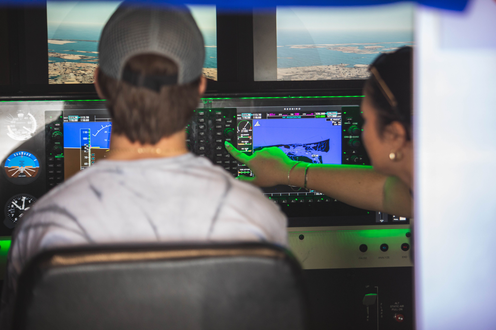

Training to become a pilot involves more than just getting into an aircraft and flying. It requires thorough preparation, practice, and the ability to handle a wide range of situations, both expected and unexpected. At High Tide Aviation, the **Redbird FMX flight simulator** is a vital tool that helps students develop the necessary skills and confidence in a controlled environment.

_A student at High Tide Aviation meticulously planning a flight during ground school, emphasizing the importance of preparation in pilot training._

### Why Use Flight Simulators?

1. **Practice Without the Risk**

Flying can be risky, especially when learning complex maneuvers or handling emergency procedures. The **Redbird FMX simulator** allows students to practice these scenarios without the dangers associated with actual flight. This provides a safe environment to learn and make mistakes, which is crucial since there is no margin for error in the air.

2. **Cost-Effective Flight Hours**

Flight training can be expensive, with costs including fuel, maintenance, and instructor time. Simulators like the Redbird FMX offer a more cost-effective way to build flight hours, allowing students to practice extensively without the financial burden. This makes quality training more accessible to a wider range of students.

3. **Repetition for Mastery**

Achieving mastery in a maneuver or procedure doesn't always happen on the first try. One of the advantages of using a simulator is the ability to repeat specific tasks as often as needed until they are perfected. This repetition builds muscle memory and confidence, making students more prepared for real-world flying.

4. **Training Flexibility**

Simulators provide the flexibility to train under any conditions, regardless of weather or daylight. This ensures that training can continue without interruption, allowing students to progress through their programs efficiently.

### High Tide Aviation’s Redbird FMX: An Optimal Training Tool

The **Redbird FMX simulator** at High Tide Aviation is more than just a piece of equipment—it’s an integral part of our training philosophy. The Redbird FMX is a full-motion, advanced flight simulator that offers an immersive and realistic training experience. It features wrap-around visuals, an enclosed cockpit, and the ability to simulate a wide range of aircraft types and flight conditions.

**Key features of the Redbird FMX include:**

- **Full-Motion Capabilities:** The full-motion system provides the physical sensations of flight, such as turbulence and turns, offering a realistic experience that stationary simulators cannot.

- **Realistic Cockpit Environment:** The enclosed cockpit replicates the controls, instruments, and displays found in actual aircraft, creating an authentic training environment.

- **Customizable Scenarios:** The Redbird FMX can simulate a variety of flight scenarios, allowing instructors to tailor training to the specific needs of each student, from instrument approaches to emergency procedures.

_A student working with a Certified Flight Instructor (CFI) in the Redbird FMX simulator at High Tide Aviation, practicing vital flight procedures in a realistic environment._

### Where Simulators Fit in Your Training

Simulators are invaluable, but they complement rather than replace real flight experience. At High Tide Aviation, we integrate simulator sessions with actual flight lessons to ensure a well-rounded education. This approach allows students to apply what they've learned in the simulator to their time in the air, resulting in more productive and focused flight hours.

**Integrating Simulator Time with Flight Hours**

Simulator sessions are strategically incorporated into our training programs, complementing real flight hours. This integration ensures that students develop into capable and confident pilots who can handle the challenges of flying.

### The Value of High Tide Aviation’s Training Approach

**Experienced Instructors**

Our instructors bring years of real-world experience to the table and are skilled in using the simulator to enhance learning. They are committed to providing constructive feedback that helps students progress in their training.

**Well-Equipped Facilities**

High Tide Aviation offers a professional and supportive environment with facilities designed to prepare students to be competent and confident pilots. Our commitment to quality training is reflected in every aspect of our operations, from our aircraft fleet to the Redbird FMX simulator.

### Ready to Take the Next Step?

If you're serious about becoming a pilot, High Tide Aviation offers the tools and training you need to succeed. The Redbird FMX simulator provides an opportunity to hone your skills in a practical and effective way. Interested in learning more? [Schedule a session](https://hightideaviation.com/flight-simulator/) or contact us today to see how we can help you achieve your pilot goals.
